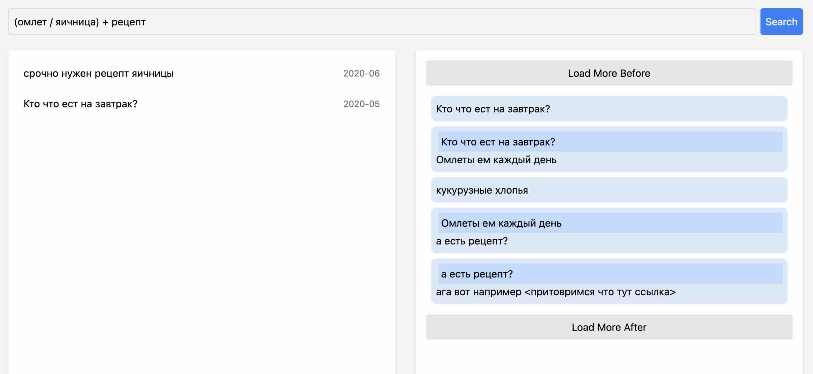
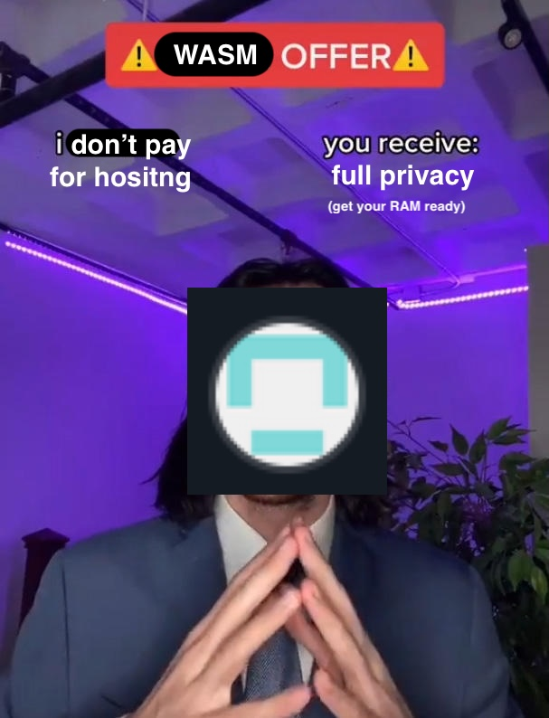

# Chat Searcher
## Usage

1. [Export](https://telegram.org/blog/export-and-more) a telegram **chat** in a JSON format
2. Upload the `result.json` file (the website runs in the browser and no data is saved)
3. Search and browse threads and messages

---

1. [Экспортируйте](https://telegram.org/blog/export-and-more) телеграм-чат в формате JSON
2. Загрузите файл `result.json` (сайт работает полностью в браузере, и никакие данные не сохраняются)
3. Производите поиск по тредам и сообщениям


UI looks like this:





## Building

1. Install Trunk, add wasm32 target
```sh
cargo install trunk
rustup target add wasm32-unknown-unknown
```
2. Download the `lemmatization-ru.tsv.gz` file from releases and place it under the `/data` directory. Alternatively, download the morphological dictionary from [OpenCorpora's website](https://opencorpora.org/?page=downloads), place it under `/data`, run the `scripts/preprocess_opcorpora.py` script, and gzip the result
3. Run the project
```sh
trunk serve --port 3000 --release
```
4. The project will be available at localhost:3000/wasm-chat-searcher


## License

All the code is licensed under MIT License

The file `lemmatization-ru.tsv.gz` in this repository's GitHub releases is a derivative of [OpenCorpora](https://opencorpora.org/?page=downloads)'s Russian language morphologic dictionary and is licenced under [Creative Commons Attribution-ShareAlike 3.0](https://creativecommons.org/licenses/by-sa/3.0/deed.en)

---

Весь код находится под лицензией MIT

Файл `lemmatization-ru.tsv.gz` в GitHub-релизах этого репозитория является производной от морфологического словаря [OpenCorpora](https://opencorpora.org/?page=downloads) и находится под лицензией [Creative Commons Attribution-ShareAlike 3.0](https://creativecommons.org/licenses/by-sa/3.0/deed.ru)
